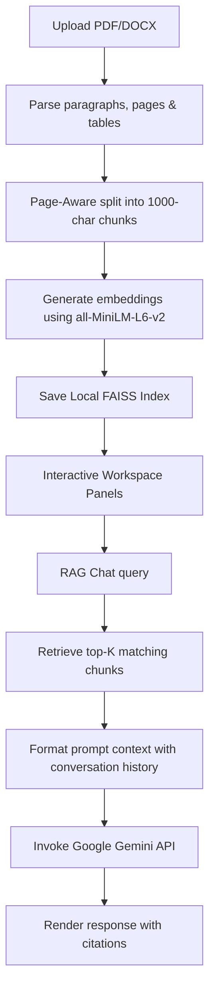

# 🎓 DocSensei - Premium AI PDF & DOCX QA System

DocSensei is a premium, localized document question-answering system designed to index, search, and chat with your research papers, notes, and business agreements. Powered by LangChain, local FAISS vector stores, Hugging Face embeddings, and Google's Gemini-2.5-Flash model, DocSensei provides a highly visual, responsive layout that switches seamlessly between light and dark modes.

---

## 🚀 Key Features

*   **Premium Interactive Welcome Landing**: Designed as a modern product dashboard showing clear application capabilities, tech tags, and a guide card when no files are loaded.
*   **Page-Aware Parsing & Extraction**: Supports both PDF (`pypdf`) and Word (`docx` paragraphs and tables) loaders, maintaining accurate page indexes for search citations.
*   **Local FAISS Vector DB**: Splits documents into manageable chunks and stores embeddings locally on disk, meaning zero data leakage to external database clouds.
*   **Context-Aware Chat & Retrieval-Augmented Generation (RAG)**: Ask natural language questions and receive precise answers with expandable sources citing specific file names, pages, and context snippets.
*   **Dynamic Theme Toggle switch**: A simple toggle in the sidebar switches the UI instantly between a sleek Dark Mode and a highly accessible Light Mode color scheme.
*   **Suggested Questions Grid**: Provides one-click action cards for common prompts (e.g., *Summarize this document*, *Key Topics*, *Generate MCQs*) when a document is first uploaded.
*   **Interactive Search Panel**: Perform keyword-matching queries that search the document database and highlight found matches in real-time.
*   **Exportable Conversations**: Download your chat histories directly as `.md` file logs.

---

## 🛠️ Tech Stack & Architecture

*   **Frontend UI**: [Streamlit](https://streamlit.io/) with custom vanilla CSS overrides.
*   **Orchestration**: [LangChain](https://www.langchain.com/) for RAG chaining and memory context.
*   **Embeddings**: `sentence-transformers/all-MiniLM-L6-v2` loaded locally via Hugging Face.
*   **Vector Database**: [FAISS](https://github.com/facebookresearch/faiss) (Facebook AI Similarity Search) stored locally.
*   **LLM Model**: `gemini-2.5-flash` via `langchain-google-genai`.

### System Processing Workflow



---

## 💻 Installation & Setup

Follow these steps to run DocSensei on your local machine:

### 1. Prerequisites
Ensure you have **Python 3.9 to 3.11** installed.

### 2. Clone the Repository
```bash
git clone https://github.com/Prem836/AI-project.git
cd AI-project
```

### 3. Create a Virtual Environment
```bash
python -m venv venv
venv\Scripts\activate   # On Windows
source venv/bin/activate # On Unix/macOS
```

### 4. Install Dependencies
```bash
pip install -r requirements.txt
```

### 5. Environment Variables (`.env`)
Create a `.env` file in the root directory and specify your Gemini API Key:
```env
GOOGLE_API_KEY="your-gemini-api-key-here"
```

---

## 🚀 Running the Application

To launch DocSensei locally:
```bash
streamlit run app.py
```
Open `http://localhost:8501` in your web browser.

> [!TIP]
> **Developer Quick-Load Mode**: Enable development options (like *Load Test Files* and *Clear Cache*) by appending the query parameter: `http://localhost:8501/?dev=true`.

---

## 🧪 Testing

To run automated E2E tests validating parsing, chunking, and database ingestion for small, medium, and large files:
```bash
python scratch/test_day9.py
```